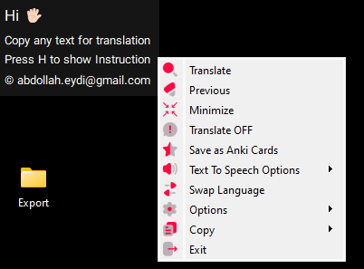

# Translator

## Overview

The application uses Google Translate and the Oxford American Dictionary to translate texts copied to the clipboard as well as creating Anki flashcards.

## Build Executable Application

I recommend using pyinstaller or auto-py-to-exe for creating windows executable, you can use this command to build that:

- pyinstaller --noconfirm --onedir --windowed --icon ".../Translator/icons/Translator.ico" --add-data ".../Translator/icons;icons/" --add-data ".../Translator/font;font/" --add-data ".../Translator/spellchecker;spellchecker/" --add-data ".../Translator/properties.json;." --hidden-import "pyttsx3.drivers.sapi5" ".../Translator/Translator.py”

For macOS use this: python3 setup.py py2app

## Download

To download executables for Windows or macOS, you can click [here](https://drive.google.com/drive/folders/1YyON-YMzFWy4gale_wVo0c9PEwDv11Jz?usp=sharing).

  

